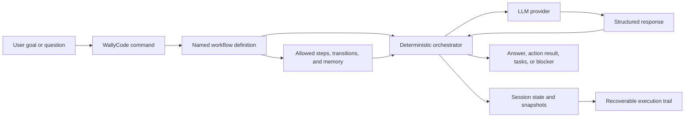
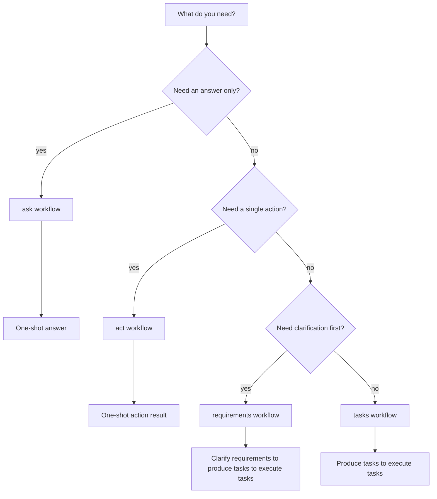
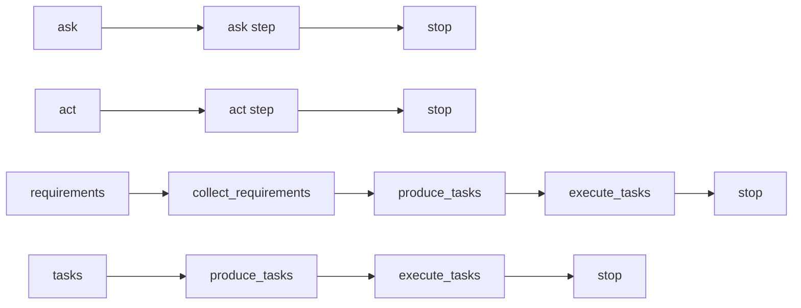
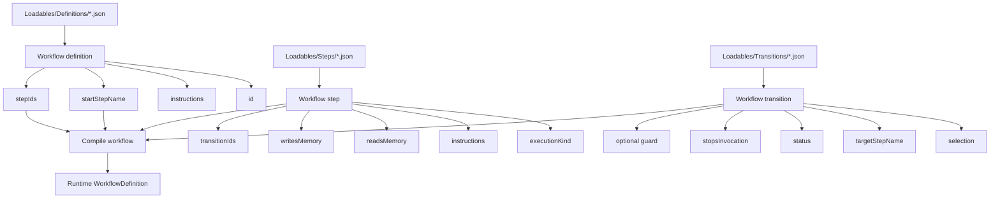
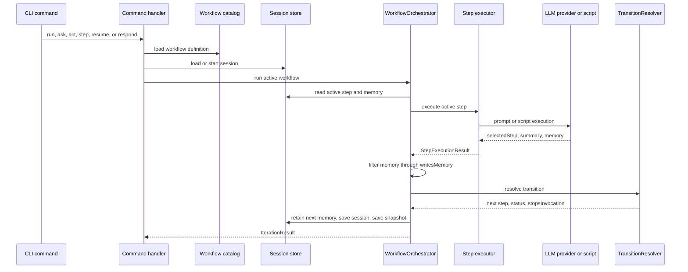
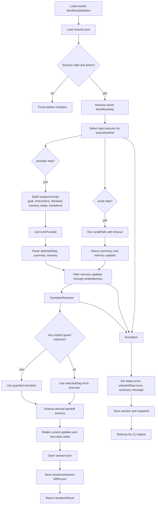
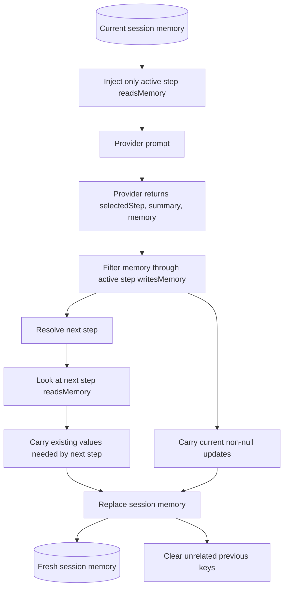
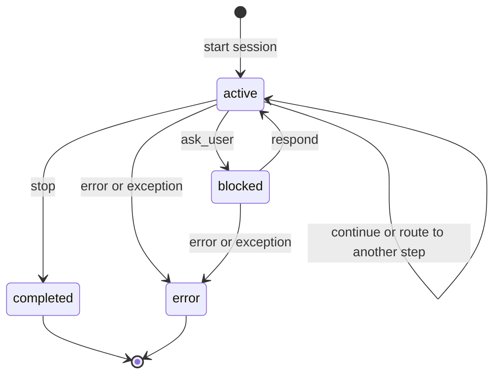
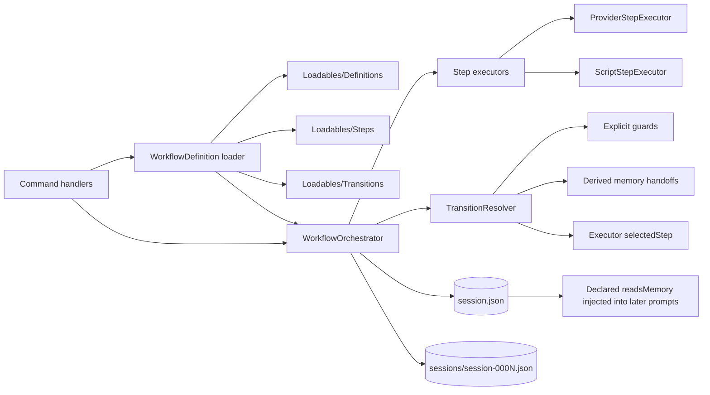

# WallyCode Architecture Diagrams

WallyCode is centered on a deterministic workflow orchestrator. LLMs provide judgment, routing suggestions, and perspective, but the runtime owns workflow definitions, session state, memory retention, executor selection, transition resolution, and snapshots.

This document is layered by audience. Start near the top for business context and user workflows; move down for authoring and runtime details.

## Executive Overview

This view is for directors, sponsors, and business users who need to understand what WallyCode controls and why workflow definitions matter.

Key point: the LLM is not running an open-ended process. WallyCode constrains each run through a named workflow, declared steps, allowed transitions, and declared memory contracts.

## User Workflow Diagrams

This view helps users pick the right workflow for the job.

The built-in workflow paths are intentionally different sizes:

`ask` and `act` are one-shot workflows. The multi-step workflows exist for work that benefits from clarification, task planning, and execution handoffs.

## Workflow Authoring Model

This view is for users and developers who want to understand or extend the JSON loadables.

The definition selects which shared steps are in the workflow. Each step selects which shared transitions are allowed. When compiled, transitions that target steps outside the workflow are filtered out.

## Runtime Orchestration

This sequence shows one normal workflow iteration from command invocation to saved session state.

A more detailed control-flow view of the same iteration:

## Memory And Session Lifecycle

This view explains how WallyCode avoids stale context while still carrying forward the memory the next step needs.

Session status is separate from memory. Status determines whether the workflow can continue, is waiting on the user, or is terminal.

Memory is a handoff packet, not a permanent notebook. If a later step still needs context, that context must either be declared in the next step's `readsMemory` or written again by the current step.

## Developer Responsibility Split

This view is for maintainers who need to know which component owns each part of execution.

## Key Invariants

- `WorkflowOrchestrator` owns session mutation and snapshots.
- Workflow definitions own workflow-level instructions, start step, and allowed step IDs. Compiled workflows expose only transitions whose targets stay inside those allowed step IDs.
- Step executors produce `StepExecutionResult`; they do not directly mutate the session.
- Provider steps call the LLM and parse strict JSON: `selectedStep`, `summary`, and optional `memory`.
- Script steps are deterministic executors for future verification, build, and local command steps.
- `writesMemory` is enforced by filtering provider or script memory updates before persistence.
- After each successful iteration, session memory is replaced with the current non-null memory updates plus existing keys declared by the next step's `readsMemory`; unrelated previous memory is cleared.
- Explicit guarded transitions are evaluated before model-selected transitions.
- Target-step handoff memory is derived from `writesMemory` and `readsMemory`, so basic artifact readiness does not need custom guard JSON.
- `continue`, route transitions, `ask_user`, `stop`, and `error` are the externally visible routing vocabulary.
