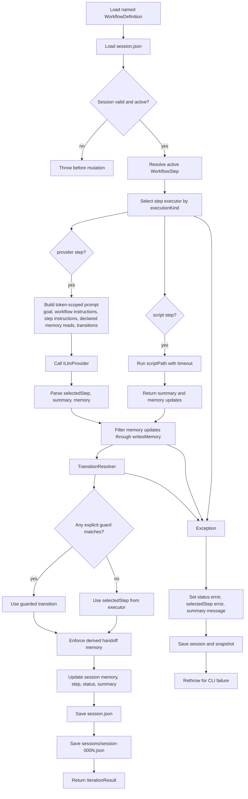
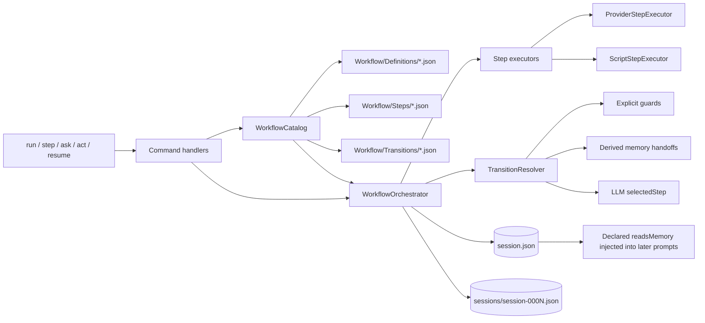

# WallyCode Architecture Diagrams

WallyCode is centered on a deterministic workflow orchestrator. LLMs still provide judgment, routing suggestions, and perspective, but the runtime owns workflow definitions, session state, memory persistence, executor selection, guarded transition resolution, and snapshots.

## 1. One Orchestrated Iteration

## 2. Responsibility Split

## Key Invariants

- `WorkflowOrchestrator` owns session mutation and snapshots.
- Workflow definitions own workflow-level instructions, start step, and allowed step IDs. Compiled workflows expose only transitions whose targets stay inside those allowed step IDs.
- Step executors produce `StepExecutionResult`; they do not directly mutate the session.
- Provider steps call the LLM and parse strict JSON: `selectedStep`, `summary`, and optional `memory`.
- Script steps are deterministic executors for future verification, build, and local command steps.
- `writesMemory` is enforced by filtering provider or script memory updates before persistence.
- Explicit guarded transitions are evaluated before model-selected transitions.
- Target-step handoff memory is derived from `writesMemory` and `readsMemory`, so basic artifact readiness does not need custom guard JSON.
- `continue`, route transitions, `ask_user`, `stop`, and `error` are the externally visible routing vocabulary.
